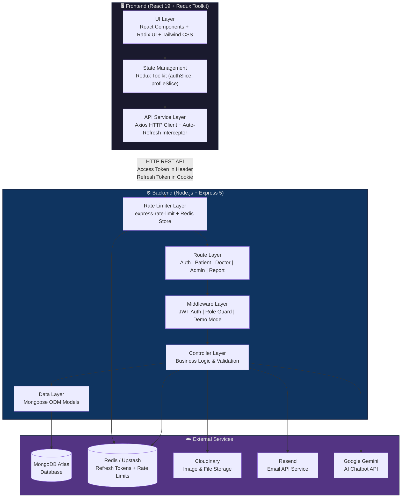
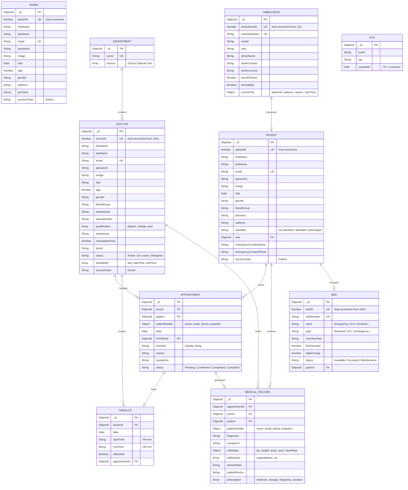
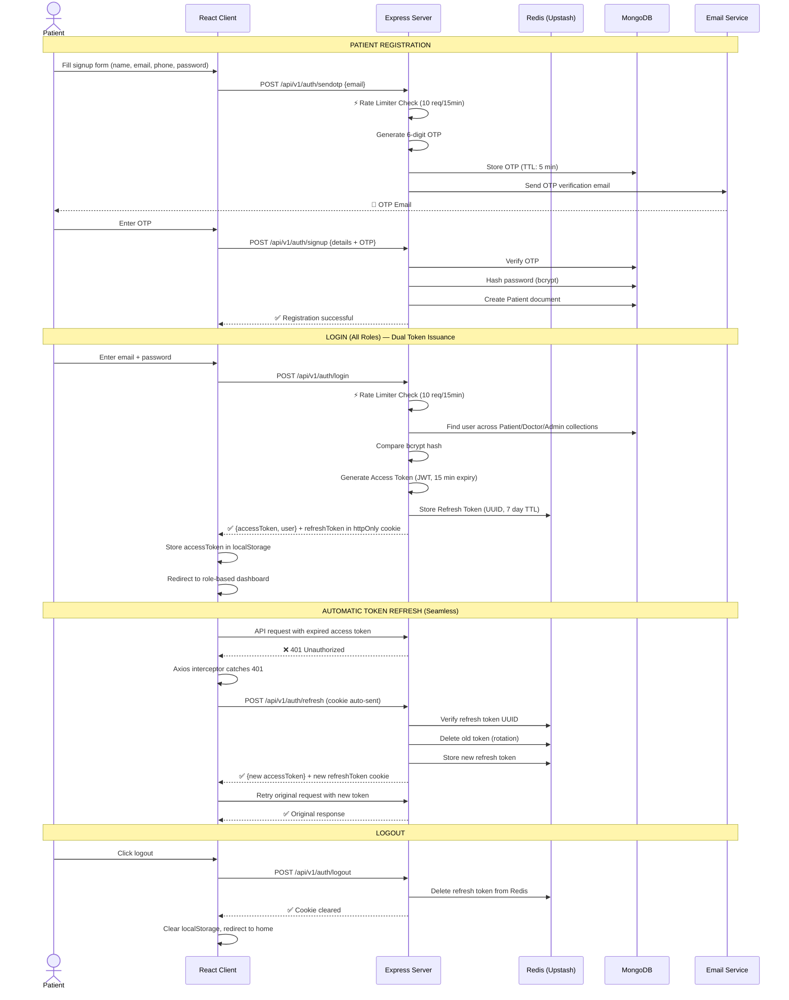
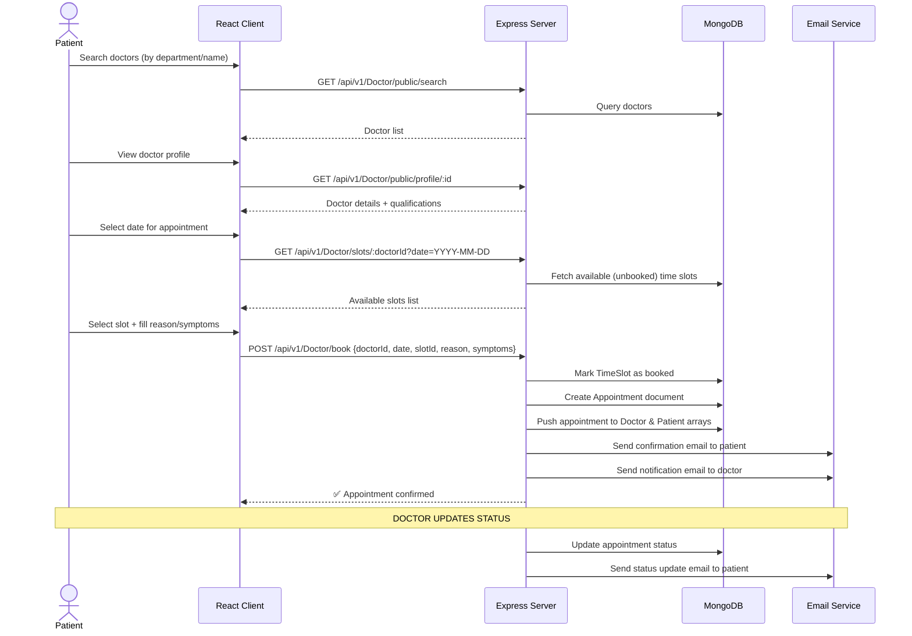
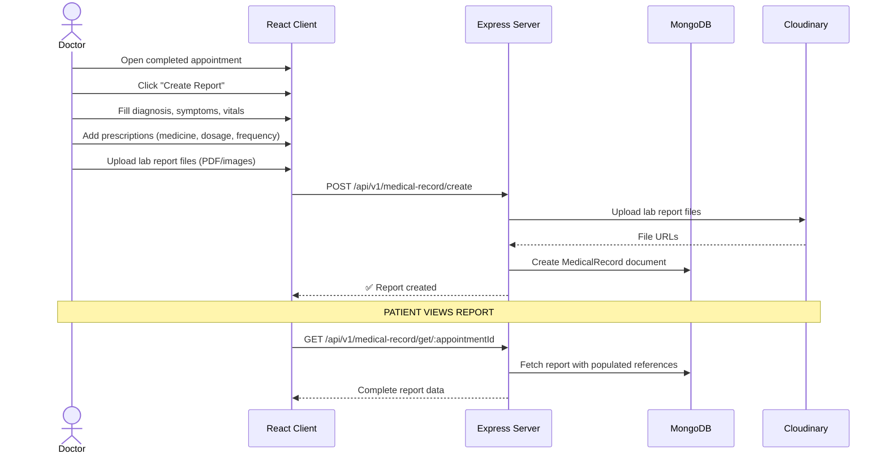
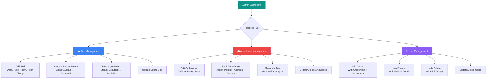
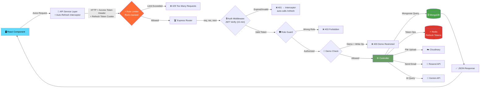

# 🏥 Hospital Management System

### A Full-Stack Healthcare Platform for Managing Patients, Doctors, Appointments & Hospital Resources

[](https://react.dev/)
[](https://nodejs.org/)
[](https://www.mongodb.com/)
[](https://upstash.com/)
[](https://tailwindcss.com/)
[](https://cloudinary.com/)
[](https://ai.google.dev/)

</div>

---

## 🔍 About The Project

The **Hospital Management System** is a production-ready, full-stack web application designed to digitize and streamline the core operations of a hospital. It provides **role-based dashboards** for three distinct user types — **Admin**, **Doctor**, and **Patient** — each with tailored interfaces and functionality.

The platform covers the complete hospital workflow: from patient registration and doctor discovery, through appointment booking with real-time slot management, to clinical documentation with medical records, prescriptions, and vitals tracking. It also includes resource management for **beds** and **ambulances**, an **AI-powered medical chatbot** (Google Gemini), and **automated email notifications** for every critical event.

### What makes this project stand out?

- 🏗️ **Production-Grade Architecture** — Clean separation of concerns with MVC pattern, RESTful APIs, and Redux state management.
- 🔐 **Enterprise-Level Security** — Dual-token authentication (short-lived JWT access tokens + Redis-backed refresh tokens), role-based authorization middleware, bcrypt password hashing, rate limiting, and demo mode protection.
- ⚡ **Redis-Powered Infrastructure** — Upstash Redis for refresh token storage with instant revocation, token rotation on every refresh, and distributed rate limiting across server instances.
- 🛡️ **3-Tier Rate Limiting** — Redis-backed rate limiters protecting auth routes (10 req/15min), sensitive endpoints (5 req/15min), and all API routes (100 req/min) against brute-force and abuse.
- 🤖 **AI Integration** — Built-in medical chatbot powered by Google Gemini API for symptom guidance and hospital information.
- 📧 **Automated Email System** — Beautiful HTML email templates for OTP verification, appointment confirmations, status updates, and account creation.
- 📊 **Rich Analytics Dashboards** — Each role gets KPI cards, charts (Recharts), and real-time statistics on their dashboard overview.
- 🛏️ **Resource Management** — Full CRUD + allocation/discharge workflows for beds and ambulance booking/trip management.

---

## ✨ Key Features

### 👨‍⚕️ For Doctors
| Feature | Description |
|---|---|
| **Dashboard Overview** | KPIs, appointment charts, and recent activity at a glance |
| **Time Slot Management** | Create, view, and delete availability slots with overlap detection |
| **Appointment Management** | View, filter, and update appointment statuses (Pending → Confirmed → Completed) |
| **Patient Records** | Access list of all unique patients treated, with history |
| **Medical Reports** | Create and update visit reports with diagnosis, vitals, prescriptions, and lab report uploads |
| **Profile Management** | Edit personal & professional details, update profile picture via Cloudinary |

### 🧑‍🤝‍🧑 For Patients
| Feature | Description |
|---|---|
| **Dashboard Overview** | Active appointments, last visit info, and vitals overview |
| **Find & Book Doctors** | Search doctors by department/specialization, view profiles, and book appointments |
| **Appointment Tracking** | View upcoming and past appointments with status updates |
| **Medical Reports** | Access visit reports, prescriptions, and lab results |
| **Profile Management** | Edit personal details, emergency contacts, and profile picture |
| **AI Health Assistant** | Chat with Gemini-powered bot for symptom guidance |

### 🛡️ For Admins
| Feature | Description |
|---|---|
| **Dashboard Analytics** | Hospital-wide statistics with user counts, appointment trends, and resource utilization |
| **User Management** | Full CRUD for Doctors, Patients, and other Admins |
| **Appointment Scheduling** | Fix/schedule appointments on behalf of patients |
| **Bed Management** | Add beds, assign wards/rooms, allocate to patients, and manage discharges |
| **Ambulance Fleet** | Manage vehicles, book trips, track active trips, and complete trips |
| **Profile Management** | Edit admin profile and display picture |

### 🌐 Public Features
| Feature | Description |
|---|---|
| **Home Page** | Hero section, services showcase, about section, and appointment CTA |
| **Doctor Directory** | Browse and search all available doctors without login |
| **About & Contact** | Hospital information and contact form |
| **AI Chatbot** | Medical assistant available without authentication |
| **Email Verification** | OTP-based email verification during patient signup |

---

## 📸 Demo Video


https://github.com/user-attachments/assets/274eed7a-31e5-4028-bc0d-8ab475d5a291


---

## 🏗️ System Architecture



---

## 🗄️ Database Schema Design



---

## 🔄 Workflow Diagrams

### 1. User Authentication Flow (Dual-Token System)



### 2. Appointment Booking Flow



### 3. Medical Report Workflow



### 4. Admin Resource Management Flow



### 5. Complete Request Lifecycle



---

## 🛠️ Tech Stack

### Frontend
| Technology | Purpose |
|---|---|
| **React 19** | UI library with functional components & hooks |
| **Redux Toolkit** | Global state management (auth & profile slices) |
| **React Router v7** | Client-side routing with nested layouts |
| **Tailwind CSS 3.4** | Utility-first CSS framework |
| **Radix UI** | Accessible, unstyled component primitives |
| **Recharts** | Dashboard charts and data visualization |
| **Framer Motion** | Animations and transitions |
| **React Hook Form + Zod** | Form handling with schema validation |
| **Axios** | HTTP client for API communication |
| **React Markdown** | Render AI chatbot responses |
| **Lucide React** | Modern icon library |

### Backend
| Technology | Purpose |
|---|---|
| **Node.js** | Runtime environment |
| **Express 5** | Web framework for REST APIs |
| **Mongoose 8** | MongoDB ODM with schema validation |
| **JWT (jsonwebtoken)** | Short-lived access tokens (15 min) for stateless authentication |
| **Redis (ioredis)** | Refresh token storage, rate limit counters, instant token revocation |
| **express-rate-limit** | 3-tier rate limiting middleware (auth, strict, global) |
| **rate-limit-redis** | Redis-backed store for distributed rate limiting |
| **uuid** | Opaque refresh token generation (cryptographically random) |
| **bcrypt** | Password hashing |
| **Cloudinary** | Cloud storage for images and documents |
| **Resend** | HTTP email API service with HTML templates |
| **Google Generative AI** | Gemini API for medical chatbot |
| **Razorpay** | Payment gateway integration (planned) |
| **express-fileupload** | Multipart file upload handling |

### Database & Cache
| Technology | Purpose |
|---|---|
| **MongoDB Atlas** | Cloud-hosted NoSQL database |
| **Mongoose** | Schema modeling, validation, pre-save hooks, indexing |
| **Redis (Upstash)** | Cloud-hosted Redis for refresh tokens (key: `refresh:<uuid>`, TTL: 7 days) and rate limit counters (key: `rl:<prefix>:<ip>`) |

---

## 📁 Folder Structure

```
hospital_management_system/
│
├── public/                          # Static assets
├── src/                             # ⚛️ FRONTEND SOURCE
│   ├── Components/
│   │   ├── Common/                  # Shared components
│   │   │   ├── Navbar.jsx           #   Navigation bar
│   │   │   ├── Footer.jsx           #   Site footer
│   │   │   ├── Openroute.jsx        #   Public route guard
│   │   │   ├── Privateroute.jsx     #   Auth route guard
│   │   │   └── ScrollToTop.jsx      #   Scroll restoration
│   │   ├── Core/
│   │   │   ├── Admin/               #   Admin dashboard sections
│   │   │   │   ├── OverviewSection  #     KPI cards & charts
│   │   │   │   ├── AddDoctorSection #     CRUD doctors
│   │   │   │   ├── AddPatientSection#     CRUD patients
│   │   │   │   ├── AddBedSection    #     Bed management
│   │   │   │   ├── AddAmbulance...  #     Ambulance fleet
│   │   │   │   ├── FixAppointment   #     Schedule appointments
│   │   │   │   └── AdminProfile...  #     Admin profile
│   │   │   ├── Doctor/              #   Doctor dashboard sections
│   │   │   │   ├── Overview         #     Stats & recent activity
│   │   │   │   ├── AppointmentSec.. #     Manage appointments
│   │   │   │   ├── TimeSlotManager  #     Create/manage slots
│   │   │   │   ├── PatientsSection  #     Patient list
│   │   │   │   └── DoctorProfile..  #     Doctor profile
│   │   │   ├── Patient/             #   Patient dashboard sections
│   │   │   │   ├── PatientOverview  #     Dashboard home
│   │   │   │   ├── PatientAppoint.. #     Appointment history
│   │   │   │   └── PatientProfile.. #     Profile settings
│   │   │   ├── FindDoctor/          #   Public doctor search
│   │   │   │   ├── DoctorCard       #     Doctor listing card
│   │   │   │   ├── DoctorProfile    #     Full doctor profile
│   │   │   │   └── BookAppointment  #     Booking form
│   │   │   └── home/                #   Landing page sections
│   │   │       ├── Herosection      #     Hero banner
│   │   │       ├── Servicesection   #     Services grid
│   │   │       ├── About            #     About preview
│   │   │       └── Appointmentsec.. #     CTA section
│   │   └── ui/                      # Radix UI primitives (shadcn)
│   ├── Pages/                       # Route-level page components
│   │   ├── Home.jsx                 #   Landing page
│   │   ├── Login.jsx                #   Login form
│   │   ├── Signup.jsx               #   Registration form
│   │   ├── Verify-email.jsx         #   OTP verification
│   │   ├── FindDoctor.jsx           #   Doctor search page
│   │   ├── About.jsx                #   About page
│   │   ├── Contact.jsx              #   Contact form
│   │   ├── AI_Help.jsx              #   AI Chatbot interface
│   │   ├── AdminDashboard.jsx       #   Admin layout + sidebar
│   │   ├── DoctorDashboard.jsx      #   Doctor layout + sidebar
│   │   └── PatientDashboard.jsx     #   Patient layout + sidebar
│   ├── Slices/                      # Redux slices
│   │   ├── authslice.js             #   Auth state (token, user)
│   │   └── profileslice.js          #   Profile state (details)
│   ├── services/                    # API communication
│   │   ├── api.js                   #   Endpoint constants
│   │   ├── apiConnector.jsx         #   Axios wrapper
│   │   └── operations/              #   Thunk-style API calls
│   ├── Data/                        # Static data
│   ├── hooks/                       # Custom React hooks
│   ├── reducers/                    # Redux store config
│   ├── lib/                         # Utility functions
│   ├── img/                         # Image assets
│   ├── App.js                       # Root component + routing
│   └── index.js                     # React entry point
│
├── server/                          # ⚙️ BACKEND SOURCE
│   ├── config/
│   │   ├── database.js              #   MongoDB connection
│   │   ├── cloudinary.js            #   Cloudinary setup
│   │   └── redis.js                 #   ⚡ Redis client (ioredis + Upstash)
│   ├── controllers/
│   │   ├── Admincontroller.js       #   Admin business logic
│   │   ├── Doctorcontroller.js      #   Doctor business logic
│   │   ├── Patientcontroller.js     #   Patient business logic
│   │   ├── ReportController.js      #   Medical records logic
│   │   ├── Login.js                 #   Auth logic (login, refresh, logout, password)
│   │   ├── Common.js                #   Shared (contact, AI, images)
│   │   └── overview.js              #   Dashboard stats logic
│   ├── middlewares/
│   │   ├── auth.js                  #   JWT access token verify + role guards
│   │   ├── isDemo.js                #   Demo account restrictions
│   │   └── rateLimiter.js           #   ⚡ 3-tier rate limiting (Redis-backed)
│   ├── models/
│   │   ├── Patient.js               #   Patient schema
│   │   ├── Doctor.js                #   Doctor schema
│   │   ├── Admin.js                 #   Admin schema
│   │   ├── Appointment.js           #   Appointment schema
│   │   ├── Slot.js                  #   TimeSlot schema (overlap detection)
│   │   ├── Medicalrecord.js         #   Visit report schema
│   │   ├── Bed.js                   #   Bed schema
│   │   ├── Ambulance.js             #   Ambulance schema
│   │   ├── Department.js            #   Department schema
│   │   └── OTP.js                   #   OTP schema (TTL)
│   ├── routes/
│   │   ├── Auth_routes.js           #   /api/v1/auth/* (with rate limiters)
│   │   ├── Patient_routes.js        #   /api/v1/Patient/*
│   │   ├── Doctor_routes.js         #   /api/v1/Doctor/*
│   │   ├── Admin_routes.js          #   /api/v1/Admin/*
│   │   └── Report_routes.js         #   /api/v1/medical-record/*
│   ├── mail/templates/              #   HTML email templates
│   │   ├── VerificationEmail.js     #     OTP email
│   │   ├── AccountCreationMail.js   #     Welcome email
│   │   ├── AppointmentConfirm...    #     Booking confirmation
│   │   ├── AppointmentStatusUp...   #     Status change alerts
│   │   ├── AppointmentPendingM...   #     Pending notifications
│   │   └── AppointmentExpiryMa...   #     Expiry reminders
│   ├── utils/
│   │   ├── mailSender.js            #   Resend email API client
│   │   ├── FileUploader.js          #   Cloudinary upload helper
│   │   └── tokenService.js          #   ⚡ Access/refresh token generation & revocation
│   ├── index.js                     #   Server entry point (+ global rate limiter)
│   └── package.json                 #   Backend dependencies
│
├── package.json                     # Frontend dependencies + scripts
├── tailwind.config.js               # Tailwind configuration
├── postcss.config.js                # PostCSS configuration
└── .gitignore                       # Git ignore rules
```

---

## 🚀 Getting Started

### Prerequisites

Make sure you have the following installed on your machine:

- **Node.js** (v18 or higher) — [Download](https://nodejs.org/)
- **npm** (v9 or higher) — Comes with Node.js
- **MongoDB Atlas** account — [Sign up free](https://www.mongodb.com/cloud/atlas)
- **Redis** — Either local (`brew install redis`) or cloud via [Upstash](https://upstash.com/) (free tier, no credit card)
- **Cloudinary** account — [Sign up free](https://cloudinary.com/)
- **Resend** account + verified domain (for email service) — [Sign up free](https://resend.com/)
- **Google AI API Key** (for Gemini chatbot) — [Get key](https://ai.google.dev/)

### Installation

**1. Clone the repository**

```bash
git clone https://github.com/Gagan202005/Hospital_Management_System.git
cd Hospital_Management_System
```

**2. Install frontend dependencies**

```bash
npm install
```

**3. Install backend dependencies**

```bash
cd server
npm install
cd ..
```

**4. Set up environment variables**

Create a `.env` file in the **root** directory:

```env
REACT_APP_BASE_URL = http://localhost:4000/api/v1
```

Create a `.env` file in the **server/** directory:

```env
# Server
PORT = 4000

# MongoDB
MONGODB_URL = mongodb+srv://<username>:<password>@cluster.mongodb.net/<dbname>

# JWT
JWT_SECRET = your_jwt_secret_key_here

# Redis (Upstash or local)
REDIS_URL = rediss://default:<password>@<host>.upstash.io:6379

# Token Configuration
ACCESS_TOKEN_EXPIRY = 15m
REFRESH_TOKEN_TTL = 604800

# Cloudinary
CLOUD_NAME = your_cloudinary_cloud_name
API_KEY = your_cloudinary_api_key
API_SECRET = your_cloudinary_api_secret

# Email (Resend API)
RESEND_API_KEY = re_your_resend_api_key
MAIL_FROM = noreply@yourdomain.com

# Google Gemini AI
GEMINI_API_KEY = your_gemini_api_key

# CORS
CORS_ORIGIN = http://localhost:3000
```

> **Note:** The email system uses [Resend](https://resend.com/) with a verified custom domain. You need to add your domain on Resend's dashboard and configure the DNS records (MX, SPF, DKIM) to start sending emails.
>
> **Redis:** For local development, use `redis://127.0.0.1:6379`. For production, use [Upstash](https://upstash.com/) with `rediss://` (TLS). The free tier provides 10,000 commands/day.

**5. Run the application**

Start both frontend and backend concurrently:

```bash
npm run dev
```

Or run them separately:

```bash
# Terminal 1 — Frontend (React on port 3000)
npm start

# Terminal 2 — Backend (Express on port 4000)
npm run server
```

**6. Open in browser**

```
http://localhost:3000
```

---

## 🔑 Environment Variables

| Variable | Location | Description |
|---|---|---|
| `REACT_APP_BASE_URL` | Root `.env` | Backend API base URL |
| `PORT` | `server/.env` | Backend server port |
| `MONGODB_URL` | `server/.env` | MongoDB Atlas connection string |
| `JWT_SECRET` | `server/.env` | Secret key for JWT access token signing |
| `REDIS_URL` | `server/.env` | Redis connection URL (Upstash: `rediss://...`, Local: `redis://127.0.0.1:6379`) |
| `ACCESS_TOKEN_EXPIRY` | `server/.env` | JWT access token lifetime (default: `15m`) |
| `REFRESH_TOKEN_TTL` | `server/.env` | Refresh token TTL in seconds (default: `604800` = 7 days) |
| `CLOUD_NAME` | `server/.env` | Cloudinary cloud name |
| `API_KEY` | `server/.env` | Cloudinary API key |
| `API_SECRET` | `server/.env` | Cloudinary API secret |
| `RESEND_API_KEY` | `server/.env` | Resend API key for email service |
| `MAIL_FROM` | `server/.env` | Verified sender email (e.g., `noreply@yourdomain.com`) |
| `GEMINI_API_KEY` | `server/.env` | Google Generative AI API key |
| `CORS_ORIGIN` | `server/.env` | Allowed frontend origin for CORS |

---

## 📡 API Reference

### Authentication (`/api/v1/auth`)

| Method | Endpoint | Auth | Rate Limit | Description |
|---|---|---|---|---|
| `POST` | `/login` | ❌ | 🔒 authLimiter (10/15min) | Login — returns access token + refresh token cookie |
| `POST` | `/signup` | ❌ | 🔒 authLimiter (10/15min) | Patient registration |
| `POST` | `/sendotp` | ❌ | 🔒 authLimiter (10/15min) | Send email verification OTP |
| `POST` | `/refresh` | ❌ (cookie) | — | Exchange refresh token for new access token (token rotation) |
| `POST` | `/logout` | ❌ (cookie) | — | Revoke refresh token from Redis + clear cookie |
| `POST` | `/change-password` | ✅ | 🔒 strictLimiter (5/15min) | Change password + revoke refresh token |
| `POST` | `/contact` | ❌ | 🔒 strictLimiter (5/15min) | Submit contact form |
| `POST` | `/chat` | ❌ | — | AI chatbot (Gemini) |

> **Note:** All `/api/v1/*` routes also pass through a **global `apiLimiter`** (100 requests/min per IP).

### Patient Routes (`/api/v1/Patient`)

| Method | Endpoint | Auth | Role | Description |
|---|---|---|---|---|
| `GET` | `/getPatientDetails` | ✅ | Patient | Get own profile details |
| `POST` | `/editprofile` | ✅ | Patient | Update profile info |
| `POST` | `/updateDisplayPicture` | ✅ | Patient | Upload profile picture |
| `GET` | `/MyReports` | ✅ | Patient | Get medical reports |
| `GET` | `/appointments` | ✅ | Patient | Get all appointments |
| `GET` | `/dashboard-stats` | ✅ | Patient | Get dashboard KPIs |

### Doctor Routes (`/api/v1/Doctor`)

| Method | Endpoint | Auth | Role | Description |
|---|---|---|---|---|
| `GET` | `/getDoctorDetails` | ✅ | Doctor | Get own profile |
| `PUT` | `/editprofile` | ✅ | Doctor | Update profile |
| `PUT` | `/updateDisplayPicture` | ✅ | Doctor | Upload profile picture |
| `GET` | `/dashboard-stats` | ✅ | Doctor | Get dashboard KPIs |
| `POST` | `/add-time-slot` | ✅ | Doctor | Create availability slot |
| `GET` | `/get-time-slots` | ✅ | Doctor | Fetch all slots |
| `DELETE` | `/delete-time-slot` | ✅ | Doctor | Remove a slot |
| `GET` | `/patients` | ✅ | Doctor | Get patient list |
| `GET` | `/appointments` | ✅ | Doctor | Get appointments |
| `POST` | `/update-status` | ✅ | Doctor | Update appointment status |
| `GET` | `/public/search` | ❌ | — | Search doctors (public) |
| `GET` | `/public/profile/:id` | ❌ | — | Doctor profile (public) |
| `GET` | `/slots/:doctorId` | ❌ | — | Available slots for a date |
| `POST` | `/book` | ✅ | Any | Book appointment |

### Admin Routes (`/api/v1/Admin`)

| Method | Endpoint | Auth | Role | Description |
|---|---|---|---|---|
| `POST` | `/add-admin` | ✅ | Admin | Create new admin |
| `PUT` | `/updateProfile` | ✅ | Admin | Update admin profile |
| `PUT` | `/updateImage` | ✅ | Admin | Update profile picture |
| `GET` | `/dashboard-stats` | ✅ | Admin | Hospital-wide statistics |
| `GET` | `/get-all-users` | ✅ | Admin | Fetch all users |
| `POST` | `/add-doctor` | ✅ | Admin | Register new doctor |
| `PUT` | `/update-doctor` | ✅ | Admin | Update doctor details |
| `DELETE` | `/delete-doctor` | ✅ | Admin | Remove doctor |
| `POST` | `/add-patient` | ✅ | Admin | Register new patient |
| `PUT` | `/update-patient` | ✅ | Admin | Update patient details |
| `DELETE` | `/delete-patient` | ✅ | Admin | Remove patient |
| `POST` | `/fix-appointment` | ✅ | Admin | Schedule appointment |
| `POST` | `/add-ambulance` | ✅ | Admin | Add ambulance |
| `GET` | `/get-all-ambulances` | ✅ | Admin | List all ambulances |
| `PUT` | `/update-ambulance` | ✅ | Admin | Update ambulance |
| `DELETE` | `/delete-ambulance` | ✅ | Admin | Remove ambulance |
| `POST` | `/book-ambulance` | ✅ | Admin | Book ambulance trip |
| `PUT` | `/complete-ambulance-trip` | ✅ | Admin | End active trip |
| `POST` | `/add-bed` | ✅ | Admin | Add hospital bed |
| `GET` | `/get-all-beds` | ✅ | Admin | List all beds |
| `PUT` | `/update-bed` | ✅ | Admin | Update bed details |
| `DELETE` | `/delete-bed` | ✅ | Admin | Remove bed |
| `POST` | `/allocate-bed` | ✅ | Admin | Assign bed to patient |
| `PUT` | `/discharge-bed` | ✅ | Admin | Release bed |

### Medical Records (`/api/v1/medical-record`)

| Method | Endpoint | Auth | Role | Description |
|---|---|---|---|---|
| `POST` | `/create` | ✅ | Doctor | Create visit report |
| `PUT` | `/update` | ✅ | Doctor | Update existing report |
| `GET` | `/get/:appointmentId` | ✅ | Any | Fetch report by appointment |

---

## 🤝 Contributing

Contributions are what make the open source community such an amazing place to learn, inspire, and create. Any contributions you make are **greatly appreciated**.

1. Fork the Project
2. Create your Feature Branch (`git checkout -b feature/AmazingFeature`)
3. Commit your Changes (`git commit -m 'Add some AmazingFeature'`)
4. Push to the Branch (`git push origin feature/AmazingFeature`)
5. Open a Pull Request

---


<div align="center">

**⭐ If you found this project helpful, please give it a star! ⭐**

</div>
